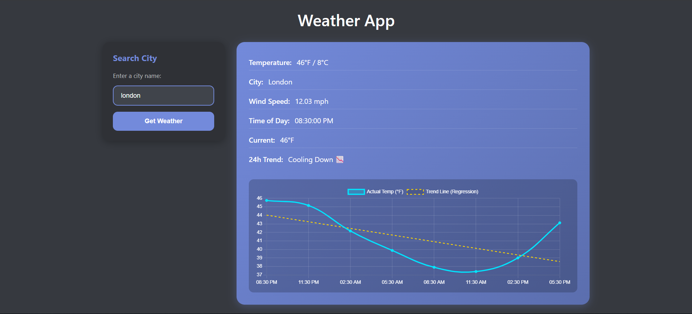

# Project Title: BetaWeather
- Description: BetaWeather is a data science-powered weather application that visualizes temperature trends using machine learning. Unlike standard weather apps that simply display forecast numbers, BetaWeather performs a Linear Regression analysis on real-time forecast data to calculate the rate of temperature change (slope/beta).

## Key features
- Real-Time Data Pipeline: Fetches 24-hour forecast data from the OpenWeatherMap API.
- Machine Learning Integration: Uses Python (Scikit-Learn & NumPy) to fit a linear regression model to the temperature data, calculating the slope ($\beta$) and intercept.
- Trend Analysis: Automatically classifies weather patterns as "Heating Up 📈," "Cooling Down 📉," or "Stable" based on the calculated slope coefficient.
- Interactive Visualization: Displays the actual temperature vs. the predicted regression trend line using Chart.js.

## Tech Stack: 
Python, Flask, Scikit-Learn, NumPy, JavaScript (Chart.js), HTML/CSS.

# How to Implement:
- start with cloning or pulling this repo to your local system.
- I recommend to use uv for faster installation of requirements and use venv for this. if you don't have uv use the 'pip install uv' command to get uv.
- paste your OpenWeatherMap api key in the weather.py and start executing the project.
- use 'uv pip install -r requirements.txt' command to install all the requirements.
- for execution directly staying the BetaWeather path, use 'uv run -- python/darkmode app.py' command to execute the code.
### Note:
- if you cant find any city name correctly in the webpage, go into the OpenWeatehMap website and see what is the actual name of the city. Because a city would be in two different places, for example: New York, England or New York, Bo District. or the city name would end with country short code. 
### Example image:
- 